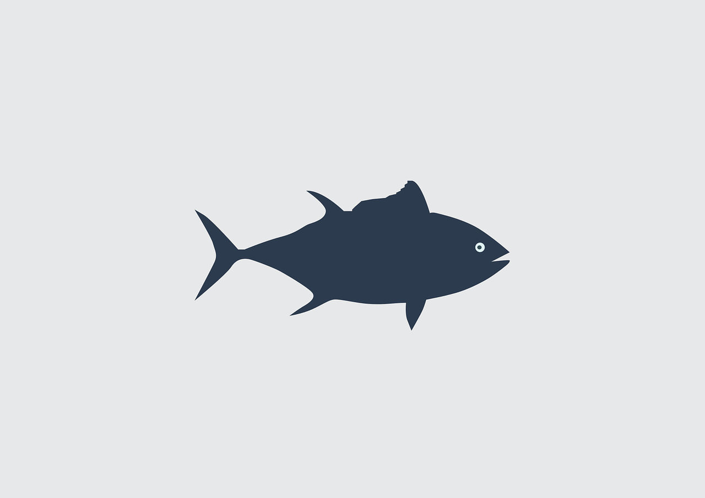

<a name="readme-top"></a>

<!-- PROJECT LOGO -->
<br />
<div align="center">
  <a href="https://github.com/onurtuna/TunaPlayer">
    
  </a>

  <h3 align="center">Tuna Player</h3>

  <p align="center">
    A video and audio player for iOS with DRM support.
    <br />
    <br />
    <a href="https://github.com/onurtuna/TunaPlayer">View Demo</a>
    ·
    <a href="https://github.com/onurtuna/TunaPlayer/issues">Report Bug</a>
    ·
    <a href="https://github.com/onurtuna/TunaPlayer/issues">Request Feature</a>
    <br />
    <br />
  </p>
</div>

<!-- ABOUT THE PROJECT -->
## About The Project

<!--
[![Product Name Screen Shot][product-screenshot]](https://example.com)
-->

Tuna Player is an easy to use video player supports DRM. The purpose of the project is to simplify the development process of the video parts for the iOS apps which do not have video-first properties.

Features:
* HLS video and audio streaming
* Control Bar
* Digital Rights Management

<p align="right">(<a href="#readme-top">back to top</a>)</p>

### Built With

* [![Swift]][Swift-url]
* [![AVFoundation]][AVFoundation-url]

<p align="right">(<a href="#readme-top">back to top</a>)</p>

<!-- GETTING STARTED -->
## Getting Started

Using Tuna Player for HLS playback is pretty easy.

* Create an instance of Tuna Player.
* For the first time use the player should be created.
* The player should be added to a UIView.
* Before playing a content the corresponding URL must be set. The playback won't start automatically.

```swift
var tunaPlayer = TunaPlayer()
```
```swift
tunaPlayer.createPlayer { [weak self] in
  guard let player = self?.tunaPlayer.getPlayer() else {
    return
  }
  playerView.addSubview(player)
  tunaPlayer.setUrl(contentUrl)
  tunaPlayer.play()
}
````

DRM support is also pretty easy.

```swift
tunaPlayer.setLicenseUrl(licenseUrl)
tunaPlayer.setCertificateData(certificateData)
```

The backend requirements for DRM

* The license server should accept body keys as "spc" and "assetid".
* The response from the license server should have the key "ckc".

## Installation

* SPM

```
https://github.com/onurtuna/TunaPlayer.git
```

* Manual

Just copy and paste the XCFramework. Make sure the path is correct for framework search paths.

<p align="right">(<a href="#readme-top">back to top</a>)</p>

<!-- LICENSE -->
## License

Distributed under the MIT License. See `LICENSE` for more information.

<p align="right">(<a href="#readme-top">back to top</a>)</p>

<!-- CONTACT -->
## Contact

Onur Tuna - [@onurtuna](https://twitter.com/your_username)

Project Link: [https://github.com/onurtuna/TunaPlayer](https://github.com/onurtuna/TunaPlayer)

<p align="right">(<a href="#readme-top">back to top</a>)</p>

<!-- MARKDOWN LINKS & IMAGES -->
<!-- https://www.markdownguide.org/basic-syntax/#reference-style-links -->
[contributors-shield]: https://img.shields.io/github/contributors/othneildrew/Best-README-Template.svg?style=for-the-badge
[contributors-url]: https://github.com/othneildrew/Best-README-Template/graphs/contributors
[forks-shield]: https://img.shields.io/github/forks/othneildrew/Best-README-Template.svg?style=for-the-badge
[forks-url]: https://github.com/othneildrew/Best-README-Template/network/members
[stars-shield]: https://img.shields.io/github/stars/othneildrew/Best-README-Template.svg?style=for-the-badge
[stars-url]: https://github.com/onurtuna/TunaPlayer/stargazers
[issues-shield]: https://img.shields.io/github/issues/othneildrew/Best-README-Template.svg?style=for-the-badge
[issues-url]: https://github.com/onurtuna/TunaPlayer/issues
[license-shield]: https://img.shields.io/github/license/othneildrew/Best-README-Template.svg?style=for-the-badge
[license-url]: https://github.com/onurtuna/TunaPlayer/blob/main/LICENSE
[product-screenshot]: images/screenshot.png
[Swift]: https://img.shields.io/badge/Swift-red
[Swift-url]: https://swift.org/
[AVFoundation]: https://img.shields.io/badge/AVFoundation-grey
[AVFoundation-url]: https://developer.apple.com/av-foundation/